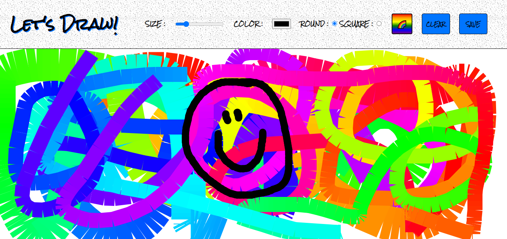

# Let's Draw!

###### September 2020

_I made a drawing app called Let's Draw! by building on the concepts I learnt in JS30 (CSS Variables and HTML5-Canvas). I'm using the HTML5 `<canvas>` to draw graphics on the page and you can adjust the size, style and colour of the brush. There is also a magical rainbow mode! 🌈 After you've finished your picture you can download it too._

### Main Learning Points:

- HTML5 `<canvas>`
- The `getContext()` method returns an object that provides methods & properties for drawing on the canvas.
- How to download a canvas image by using `canvas.toDataURL()`. This method returns a data URL containing a representation of the image in the format specified by the type parameter (defaults to PNG).
- How to add an icon to the browser tab
- `this` used in an arrow function refers to the whole window
- Lots of event listener practice
